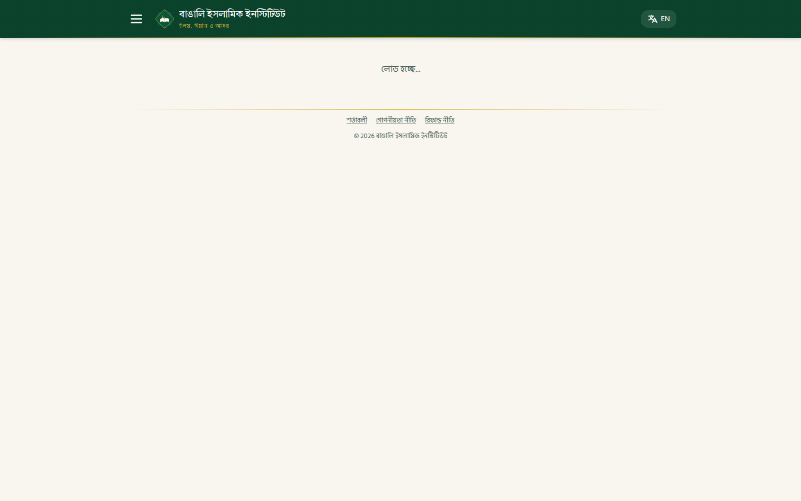
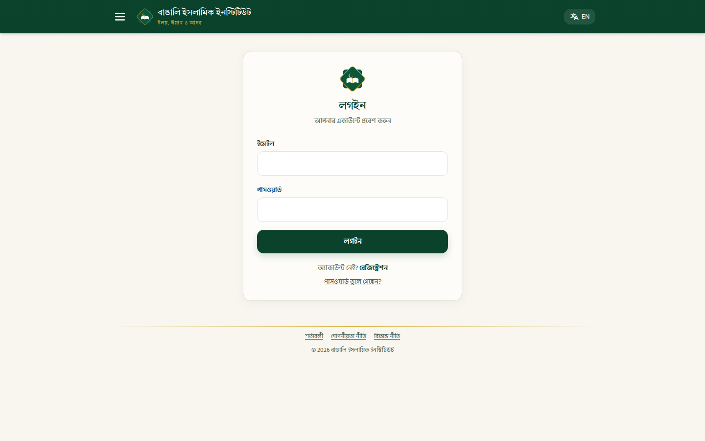
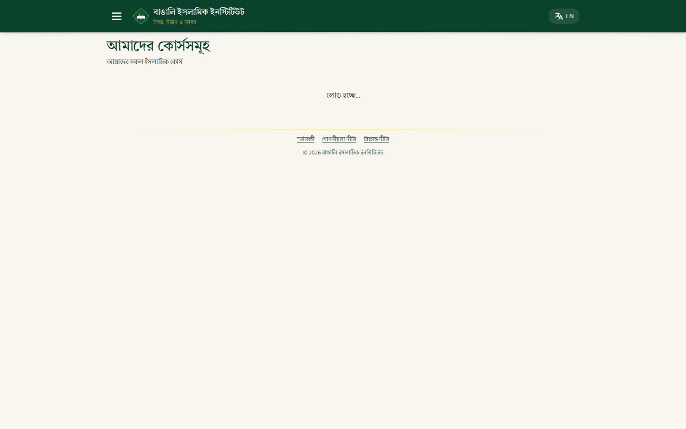
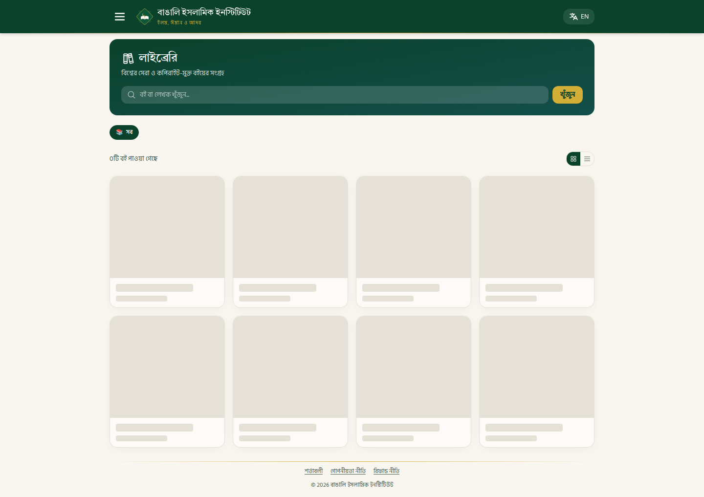

# Case Study: Bengali Islamic Institute (BII) Website

**Client:** Bengali Islamic Institute (বাঙালি ইসলামিক ইনস্টিটিউট)
**Tagline:** ইলম, ঈমান ও আদব — Knowledge, Faith & Etiquette
**URL:** [https://bengaliislamicinstitute.com](https://bengaliislamicinstitute.com)
**Timeline:** August 2–7, 2026 (6 days, 50+ commits)
**Developer:** Jarir Ahmed (solo full-stack)

---

## 1. Executive Summary

Bengali Islamic Institute is a comprehensive Islamic education platform serving Bengali-speaking Muslims worldwide. Built in just 5 days as a solo full-stack effort, the platform encompasses online courses, a digital library, e-commerce, live classes, quizzes, rewards, and a Telegram-integrated payment system — all wrapped in a culturally authentic Bengali-Islamic design system.

The project was built from scratch using **React 19 + Yii2 PHP + MySQL**, deployed via **GitHub Actions CI/CD to cPanel FTP**, and designed as a progressive web app with **Capacitor Android** support.

---

## 2. The Challenge

The institute needed a complete digital presence that could:

- **Deliver Islamic education** in Bengali with courses, quizzes, and certificates
- **Host a digital library** with PDF, EPUB, and HTML document rendering
- **Manage payments** via bKash/Nagad (Bangladesh mobile financial services)
- **Integrate with Telegram** for real-time payment notifications and admin approval
- **Scale to mobile** with Android app capability
- **Operate on shared hosting** (cPanel + FTP) — no Docker, no VPS
- **Support bilingual content** (Bengali + English) throughout

The constraint: everything had to work within the limitations of a cPanel shared hosting environment with FTP deployment.

---

## 3. Architecture & Tech Stack

### Frontend
| Technology | Purpose |
|------------|---------|
| **React 19** | SPA framework |
| **React Router 7** | Client-side routing |
| **Tailwind CSS 3.4** | Utility-first styling |
| **Radix UI** | Accessible component primitives (30+ components) |
| **Framer Motion** | Animations (sidebar, page transitions) |
| **React Hook Form + Zod** | Form validation |
| **TanStack Query + SWR** | Server state management |
| **Recharts** | Admin analytics dashboards |
| **Phosphor Icons** | Icon system |
| **Capacitor 8** | Android app wrapper |

### Backend
| Technology | Purpose |
|------------|---------|
| **Yii2 PHP Framework** | REST API (38 controllers) |
| **MySQL** | Database (raw queries, no ActiveRecord for performance) |
| **Firebase PHP-JWT** | Stateless authentication |
| **DomPDF** | Certificate PDF generation |
| **Guzzle** | HTTP client for Telegram API |
| **PHP 8.1** | Server runtime |

### Infrastructure
| Component | Solution |
|-----------|----------|
| **Hosting** | cPanel shared hosting (Bengal Islamic Institute) |
| **CI/CD** | GitHub Actions → FTP deploy via lftp |
| **Database** | MySQL (cPanel) |
| **File Storage** | Local `/uploads/` directory |
| **CDN** | jsDelivr for epub.js + JSZip |
| **Push Notifications** | Firebase Cloud Messaging |

---

## 4. Features Built

### 4.1 Student-Facing Features

**Public Landing Page (`/` — Welcome.jsx):**
- Full-width hero with dark mosque photo, emerald overlay, gold dot pattern
- Brand logo (custom 8-point Islamic star SVG with open book + crescent)
- Gold kicker: "আসসালামু আলাইকুম — স্বাগতম / As-Salamu Alaykum — Welcome"
- Two CTAs: gold Login + frosted-glass Register buttons
- "What we teach" — 6 feature cards (Quran & Tajweed, Arabic, Fiqh, Live Classes, Quiz, Akhlaq) with Phosphor duotone icons
- "How to begin" — 3-step process (Register → Enroll → Start) with Bengali numerals (১/২/৩)
- CTA strip: emerald band with "Begin your journey today"
- Contact preview (Mobile, WhatsApp, Email, Address)
- Framer Motion scroll animations, redirects logged-in users to `/home`

**User Dashboard (`/home` — Home.jsx):**
- Profile banner with circular photo, gold ring, "Welcome, {name}" heading, Student ID pill
- 12-item menu grid: Courses, My Courses, Live Classes, Videos, Dua, Quiz, Reward Zone, Shop, Library, Notifications, Contact, Complaint
- Reward Zone highlighted with emerald gradient + "New ✨" badge
- Winner Reviews carousel with touch-swipe, rank badges (🥇🥈🥉), star ratings, video embeds
- AdSense ad slots between sections

**Authentication System:**
- Registration with email verification
- Login with JWT tokens (admin → `/admin`, student → `/home`)
- Forgot password → email reset (SMTP via PHPMailer)
- Role-based access: `student`, `admin`, `super_admin`
- Protected routes (`ProtectedRoute`) and admin-only routes (`AdminRoute`)

**Digital Library (`/library` — most complex feature):**
- Hero panel: emerald→teal gradient with search bar (frosted input + gold Search button)
- Category filter tabs (horizontally scrollable pills with emoji icons)
- Grid/list view toggle, pagination, "N books found" counter
- Book cards with 8 rotating gradient backgrounds, file-type badges (PDF/EPUB/HTML), featured badges
- **Inline reader** supporting three formats:
  - **PDF** — Native browser PDF viewer via iframe
  - **EPUB** — Full epub.js v0.3.93 renderer with navigation controls
  - **HTML** — Sandboxed iframe rendering
- EPUB navigation: prev/next arrows, editable page jump, current/total indicator
- Download button for offline reading

**Courses (`/courses`):**
- Course grid (1→2→3 columns) with cover images or Islamic star pattern placeholders
- Gold "ফ্রি / Free" pill for free courses
- Instructor name + price in Bengali Taka (৳)
- Course detail pages with curriculum, enrollment flow

**Quiz System:**
- Monthly quizzes with timed questions
- Auto-grading and score tracking

**Rewards & Leaderboard:**
- Points system for course completion
- Top students leaderboard with rank badges
- Reward zone with redeemable items

**Shop & Payments:**
- Product catalog with images
- bKash/Nagad payment flow (manual + SSLCOMMERZ)
- Order tracking with transaction ID

**Other Features:**
- Daily Duas & Dhikr section
- Live classes integration
- Video library
- Project completion certificates with signature upload + PDF download
- Notifications, Complaint, Contact pages
- Legal pages (Terms, Privacy, Refund)
- Profile & settings, Change password
- 404 page with Arabic numeral "٤٠٤" and bilingual message

### 4.2 Admin Panel

**29 admin pages** covering:

- **Dashboard** — Analytics overview with Recharts visualizations
- **User Management** — Students, teachers, admins with role assignment
- **Course Management** — CRUD for courses, enrollments, course students
- **Content Management** — Posts, videos, duas, notifications
- **Library Management** — Book upload with file type detection, inline reader
- **Payment Management** — Payment requests, revenue tracking, promo codes
- **Quiz Management** — Monthly quizzes, question banks
- **Rewards System** — Admin rewards, reward zone items
- **Shop Management** — Products, orders, payment requests
- **System** — Settings, configs, backups, activity logs, login logs
- **Media** — Image/file management

### 4.3 Telegram Bot Integration

A custom Telegram bot provides real-time admin notifications:

- **Payment alerts** — New payment requests forwarded to admin chat
- **Approve/Reject buttons** — Inline keyboard buttons in Telegram
- **Shop order notifications** — Transaction ID, payment number, order details
- **Chat ID discovery** — Bot replies with chat ID on any message
- **Webhook verification** — Secret token validation for security

---

## 5. Design System

### Brand Identity
The design system was crafted to reflect Islamic aesthetics while maintaining modern web standards:

**Color Palette (CSS Custom Properties):**
| Token | Color | Usage |
|-------|-------|-------|
| `--bii-emerald` | `#0A422B` | Primary brand color (deep green — headers, buttons, accents) |
| `--bii-emerald-2` | `#0D5739` | Secondary green |
| `--bii-gold` | `#D4AF37` | Decorative accents, dividers, rank badges, metallic highlights |
| `--bii-gold-2` | `#E6BE40` | Secondary gold |
| `--bii-cream` | `#F9F6F0` | Page background (warm, not stark white) |
| `--bii-card` | `#FDFCF9` | Card surface |
| `--bii-text` | `#11261E` | Primary text (near-black green) |
| `--bii-text-soft` | `#4A5F55` | Secondary/muted text |
| `--bii-border` | `#E5E0D5` | Borders (warm sand) |

**Typography:**
- **Bengali body:** Hind Siliguri (excellent Bengali sans-serif)
- **Bengali headings:** Tiro Bangla (serif designed for Bengali)
- **English headings:** Cormorant Garamond
- **Bilingual toggle:** `useLang()` context with `pick(bn, en)` utility, runtime switching

**Brand Logo (`BrandLogo.jsx`):**
Custom inline SVG — an 8-point Islamic star formed by two overlapping emerald squares, with a gold star outline, an open white book glyph, and a small gold crescent on top. Recurs in header, sidebar, login card, and hero.

**Favicon:**
Generated from the Android app's `mipmap-xxxhdpi/ic_launcher.png` using Python PIL/Pillow. Produced `favicon.png` (192×192), `favicon.ico` (16/32/48 multi-size), and updated `logo192.png`/`logo512.png` for PWA manifest. Added `<link rel="icon">` tags to `index.html`.

**Design Patterns:**
- **Islamic geometric pattern** — CSS radial dot gradient in translucent gold (`.islamic-pattern`), used as decorative overlay on headers, heroes, cards
- **Gold dividers** — Thin gold gradient horizontal rules (`.gold-divider`) between sections
- **Tactile cards** — `.bii-card`: rounded 1rem, soft emerald-tinted shadow, hover lift (translateY -3px) with stronger shadow + subtle gold border
- **Buttons** — `.bii-btn-primary` (emerald) and `.bii-btn-gold` (gold on emerald text), both rounded
- **Mobile-first** — Responsive from 320px to 1440px+, slide-in sidebar with Framer Motion spring animation
- **Component library** — Full shadcn/ui suite (30+ Radix UI primitives) + Phosphor icons + Framer Motion

---

## 6. Problems Faced & Solutions

### 6.1 EPUB Rendering Nightmare
**Problem:** epub.js couldn't render EPUB files served from the API. The reader showed a blank page.

**Root cause:** epub.js resolves internal paths (META-INF/container.xml, OEBPS/*) relative to the serve URL. When serving from `/api/library/serve/uuid`, it tried to fetch `/api/library/serve/META-INF/container.xml` — which didn't exist.

**Solution (3 iterations):**
1. **First attempt:** Serve EPUB sub-paths via `<id:path>` route → Failed because epub.js strips the book UUID
2. **Second attempt:** Fetch EPUB as Blob, load via `new Book(blob)` → Blob URL broke sub-path resolution
3. **Final fix:** Blob loading + backend extracting files from inside the .epub ZIP archive via `ZipArchive`

```php
// Backend: Extract file from inside .epub ZIP
$zip = new \ZipArchive();
$zip->open($filePath);
$content = $zip->getFromName($subPath);
```

### 6.2 EPUB Page Count Shows "—"
**Problem:** The page indicator showed "1 / —" instead of "1 / 128".

**Root cause:** `book.locations.generate(1024)` was failing silently. Without locations, `book.locations.length()` returned 0.

**Solution:**
```jsx
// Try-catch with fallback to spine length
try {
  await bookInstance.locations.generate(1024);
  const total = bookInstance.locations.length();
  setLocation({ current: 1, total });
} catch (locErr) {
  const fallbackTotal = bookInstance.spine?.items?.length || 0;
  setLocation({ current: 1, total: fallbackTotal });
}
```

### 6.3 PDF/EPUB/HTML Renders as Raw Binary
**Problem:** PDF files displayed as raw text (`%PDF-1.7%...`) instead of rendering in the browser's PDF viewer. EPUB and HTML files had similar issues.

**Root cause:** Yii2's response component was interfering with binary file output. Even with `FORMAT_RAW`, Yii's response formatter was still processing the content.

**Solution (2 iterations):**
1. **First attempt:** Set `Yii::$app->response->format = FORMAT_RAW` → Didn't work, Yii still intercepted
2. **Final fix:** Bypass Yii entirely with native PHP for all file types:
```php
// 2026-08-06: Bypass Yii response component entirely — native PHP file output
header_remove('X-Powered-By');
header('Content-Type: ' . $contentType);
header('Content-Disposition: inline');
header('Content-Length: ' . filesize($filePath));
header('Cache-Control: public, max-age=3600');
readfile($filePath);
exit;  // ← Key: exit before Yii can touch the output
```

**HTML rendering:** Added `sandbox="allow-same-origin allow-scripts allow-forms allow-popups"` to the iframe to enable JavaScript execution and form interactions in uploaded HTML files.

### 6.4 FTP Deploy Deleting Uploads
**Problem:** `lftp mirror -R --delete` was removing the `/uploads/` directory on every deploy, destroying all user-uploaded images and books.

**Solution:** Remove `--delete` from the lftp mirror command:
```bash
# Before (destructive)
mirror -R --parallel=4

# After (safe)
mirror -R --parallel=4
```

### 6.5 CRA Build Fails on Warnings
**Problem:** Create React App treats ESLint warnings as errors when `CI=true` (set by GitHub Actions).

**Solution:** Unset `CI` in the build step:
```yaml
env:
  CI: "false"  # Don't treat warnings as errors
```

### 6.6 SMTP STARTTLS Failure
**Problem:** Password reset emails weren't sending. SMTP connection hung during STARTTLS negotiation.

**Root cause:** PHP's `stream_socket_enable_crypto()` was returning unexpected reply codes from the SMTP server.

**Solution:** Hardcoded SMTP credentials in `config/smtp.php` and fixed STARTTLS/QUIT reply code handling.

### 6.7 Admin Navbar Stacking Over Sidebar
**Problem:** On mobile, the admin navbar overlapped the sidebar drawer, making navigation impossible.

**Solution:** Added proper z-index layering and ensured sidebar backdrop covers the navbar.

### 6.8 Node.js Version Incompatibility
**Problem:** Capacitor CLI requires Node.js >= 22, but CI was using Node 20.

**Solution:** Updated `actions/setup-node` to `node-version: '22'`.

### 6.9 iframe Sandbox Blocking Scripts
**Problem:** EPUB reader's internal iframes had `sandbox` attribute that blocked JavaScript execution.

**Solution:** Register a content hook to remove the sandbox attribute:
```jsx
rendition.hooks.content.register((contents) => {
  const iframe = contents.document?.defaultView?.frameElement;
  if (iframe?.hasAttribute("sandbox")) {
    iframe.removeAttribute("sandbox");
  }
});
```

---

## 7. CI/CD Pipeline

### GitHub Actions Workflow
```yaml
name: Deploy to Production (FTP)
on:
  push:
    branches: [main]
  workflow_dispatch:

concurrency:
  group: deploy
  cancel-in-progress: true  # Cancel older deploys when newer push arrives
```

**Pipeline Steps:**
1. **Checkout** — Clone repository
2. **PHP 8.1 Setup** — Install pdo_mysql, mbstring, intl, bcmath, curl, openssl, fileinfo
3. **Backend Build** — `composer install --no-dev --prefer-dist`
4. **Node 22 Setup** — yarn cache, `yarn install --frozen-lockfile`
5. **Frontend Build** — `yarn build` with `CI=false`
6. **Staging Assembly** — `deploy/build-staging.sh` merges Backend + Frontend
7. **FTP Deploy** — `lftp mirror -R` to production (excluding .git, .env, uploads)

### Build Script (`build-staging.sh`)
The staging script assembles the merged `public_html/` directory:
```bash
# 1. Yii2 backend (excluding web/, runtime/, tests/, .env)
rsync -a --exclude '/web/' --exclude '/runtime/' --exclude '/tests/' --exclude '/env' "$BE/" "$STAGING/"

# 2. Root front controller
cp "$ROOT/deploy/index.php" "$STAGING/index.php"

# 3. Merged .htaccess (routes /api/* → Yii, else React)
cp "$ROOT/deploy/htaccess" "$STAGING/.htaccess"

# 4. Built React SPA
cp -r "$FE_BUILD/." "$STAGING/"
```

---

## 8. Database Schema

13 migrations covering:

| Migration | Purpose |
|-----------|---------|
| `m250802_000001` | Core users, roles, JWT |
| `m250802_000002` | Courses, enrollments |
| `m250802_000003` | Content (posts, videos, duas) |
| `m250802_000004` | Shop, products, orders |
| `m250802_000005` | Payments, subscriptions |
| `m250802_000006` | Rewards, points |
| `m250802_000007` | Quizzes, questions |
| `m250802_000008` | Notifications |
| `m250802_000009` | Settings, configs |
| `m250802_000010` | Admin logs, backups |
| `m250804_000011` | Content additions |
| `m250806_000012` | Library documents |
| `m250806_000001` | Fix test user password |

---

## 9. Key Metrics

| Metric | Value |
|--------|-------|
| **Total Commits** | 48 |
| **Backend Controllers** | 38 |
| **Frontend Pages** | 59 (28 student + 29 admin + 2 shared) |
| **Database Migrations** | 13 |
| **Development Time** | 5 days |
| **Bundle Size** | ~450KB gzipped |
| **API Endpoints** | 100+ |
| **File Formats Supported** | PDF, EPUB, HTML, PNG, JPG, WebP |

---

## 10. Lessons Learned

### 10.1 Yii2 + Binary Files Don't Mix
Yii2's response component is designed for JSON/HTML responses. For binary file serving, bypass it entirely with native PHP `header()` + `readfile()` + `exit`. Don't try to make Yii's formatter work — it will corrupt binary output.

### 10.2 epub.js Path Resolution is Fragile
epub.js resolves internal EPUB paths relative to the serve URL. If your serve endpoint uses UUIDs, the library will try to fetch `META-INF/container.xml` relative to that UUID. The safest approach is Blob loading with backend ZIP extraction.

### 10.3 FTP Deploy Needs `--delete` Carefully
Never use `lftp mirror --delete` if you have a shared `/uploads/` directory. It will wipe all user uploads. Either exclude uploads from the mirror or remove `--delete` entirely.

### 10.4 Sandboxed iframes Break Everything
Modern browsers sandbox iframes aggressively. EPUB readers, HTML document viewers, and embedded content all need `allow-same-origin allow-scripts` at minimum. Add `allow-forms allow-popups` for full functionality.

### 10.5 Solo Development Speed
With AI assistance (Claude Code), a single developer can build a production-grade platform in days that would traditionally take weeks. The key is:
- Clear architecture from day one
- Reusable components (CrudResource, FileUpload, ImageUpload)
- Automated CI/CD (push to deploy)
- Systematic debugging (try-catch, logging, fallbacks)

---

## 11. Future Roadmap

- [ ] Android app (Capacitor) — already scaffolded
- [ ] Firebase Cloud Messaging for push notifications
- [ ] SSLCOMMERZ payment gateway integration
- [ ] Live class video streaming
- [ ] Course progress tracking with milestones
- [ ] Multi-language support beyond Bengali/English
- [ ] Admin analytics dashboard with enrollment trends
- [ ] Automated certificate generation on course completion

---

## 12. Screenshots

> Screenshots captured from the production site and local build (August 2026).

### Public Landing (`/`)

*Header with custom 8-point Islamic star logo, "বাঙালি ইসলামিক ইনস্টিটিউট" wordmark, "ইলম, ঈমান ও আদব" tagline, and Bengali/English language toggle. Full-width hero with mosque photo, emerald overlay, gold dot pattern, "What we teach" feature cards, and "How to begin" 3-step process below.*

### Login (`/login`)

*Centered narrow card with BrandLogo, email/password form with gold focus ring, emerald "লগইন" button, and links to Register (নিবন্ধন করুন) and Forgot Password (পাসওয়ার্ড ভুলে গেছেন?).*

### Courses (`/courses`)

*Course listing page with "আমাদের কোর্সসমূহ" (Our Courses) heading, "আমাদের সকল ইসলামিক কোর্স" subtitle. Grid layout with Islamic star pattern placeholders, gold "ফ্রি / Free" pill badges, and prices in Bengali Taka (৳).*

### Library (`/library`)

*Library page with emerald hero banner "📚 লাইব্রেরি", search bar with "খুঁজুন" button, "সব" category filter chip, grid/list view toggle, and book cards with rotating gradient backgrounds. File-type badges (PDF/EPUB/HTML) and inline EPUB reader with navigation controls.*

### 404 Page

*Arabic numeral "٤٠٤" in faint emerald serif, Bengali/English bilingual message, "Go Back" and "Go Home" buttons.*

### Admin Dashboard (`/admin`)
- Revenue hero tile with emerald background
- KPI tiles for logins, admins, students, courses
- Per-course enrollment/revenue cards

### Mobile View
- Responsive sidebar drawer with Framer Motion spring animation
- Touch-swipe carousels
- Adapted card layouts (1→2→3→4 columns)

---

*This case study documents the complete development process of the Bengali Islamic Institute platform, from architecture decisions to production deployment, including every significant challenge encountered and the solutions that were implemented.*
